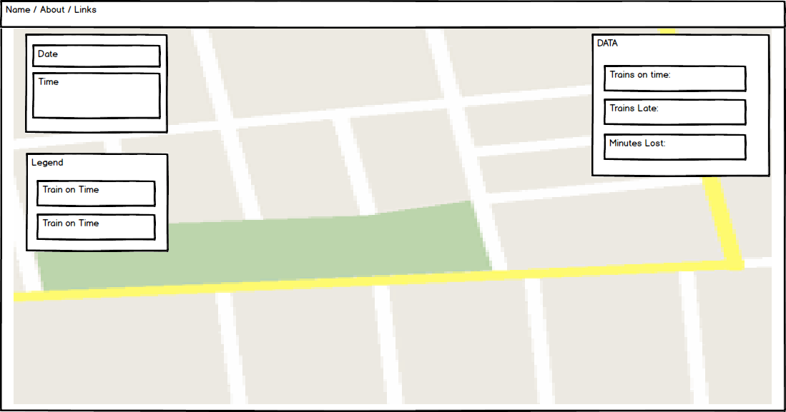

## Subwait

### Background

Ever wondered whether your train has a funky schedule or if it is just late?  
Ever tried to calculate how many minutes you have lost waiting for a late train?

Subwait is a visual representation of the MTA's subway punctuality.

By leveraging Google Maps API in tandem with NYC MTA's published schedule and real-time train GPS data, Subwait shows in a visually compelling way of how your experience is shaped.

### Functionality & MVP
Users will have the ability to:
- [ ] Pause and restart the visualization
- [ ] Interact with the map by zooming in/out and dragging the map
- [ ] Easily understand the different data points presented

### Wireframes
Subwait will consists of a single page screen that will include the main functionality as well as the various links for my personal pages. Information about the app will be presented in a modal. The entire screen will consist of the map with the different features overlaid and partially transparent.

### Architecture and Technologies

I plan on utilizing the following technologies to build Subwait.  
*These might drastically change once i start implementing the code*

+ `javascript` for the underlying logic
+ `d3.js` for the map movement rendering
+ `Webpack` to bundle all the JS files
+ `NYC MTA API`
+ `Google Maps API`

### Implementation Timeline

**Day 1**: Learn how to use and integrate both API's. Get a test map up and running using `webpack`. Convert actual MTA schedules to csv / json format

**Day 2**: Build the logic of how to present both schedules data and live data. Learn how to render moving object using `d3.js`

**Day 3**: Finish logic. CSS styling. Add the about modal.

### Bonus features

- [ ] Allow users to control the time settings
- [ ] Add ridership information
